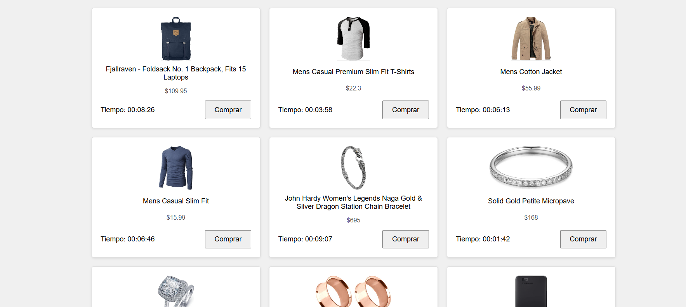

# Make It Real - Tienda de productos con contador

Esta es una solución para mostrar una tienda de productos con un contador regresivo usando JavaScript y manipulación del DOM, desarrollada durante el curso de Make It Real.

## Tabla de contenidos

- [Descripción General](#descripción-general)
  - [El Desafío](#el-desafío)
  - [Capturas de Pantalla](#capturas-de-pantalla)
- [Mi Proceso](#mi-proceso)
  - [Construido con](#construido-con)
  - [Lo que Aprendí](#lo-que-aprendí)
  - [Desarrollo Continuo](#desarrollo-continuo)
  - [Recursos Útiles](#recursos-útiles)
- [Autor](#autor)
- [Agradecimientos](#agradecimientos)

## Descripción General

### El Desafío

Debemos ser capaces de:

- Ver una lista de productos obtenidos de una API externa.
- Observar un contador regresivo en cada producto que simula una oferta por tiempo limitado.
- Ver cómo el botón "Comprar" se deshabilita automáticamente cuando el tiempo llega a cero.
- Disfrutar de una interfaz responsive que se adapta a diferentes tamaños de pantalla.
- Experimentar una carga dinámica de contenido sin recargar la página.

### Capturas de Pantalla

## Nuestro proceso

### Construido con

- HTML5 para la estructura básica de la página.
- CSS3 con metodología BEM para estilos y diseño responsive.
- JavaScript ES6+ para la lógica de la aplicación y manipulación del DOM.
- Fetch API para obtener datos de productos desde una API externa.
- Funciones de Temporización (setInterval) para los contadores regresivos.

### Lo que Aprendimos

- Consumir APIs Externas: Utilizamos fetch para obtener datos de [Fake Store Api](https://fakestoreapi.com/products`) y manejamos las respuestas de manera asíncrona con promesas.
- Implementar Contadores Regresivos: Utilizamos setInterval para crear un contador que actualiza el tiempo restante cada segundo y deshabilita el botón "Comprar" al llegar a cero.
- Aplicar la Metodología BEM: Organizamos nuestras clases CSS siguiendo BEM para mantener un código más limpio y modular.
### Desarrollo Continuo

En futuros desarrollos, consideramos:

- Agregar Funcionalidad de Carrito: Permitir a los usuarios agregar productos a un carrito de compras persistente.
- Mejorar la Accesibilidad: Asegurar que la aplicación cumpla con los estándares de accesibilidad web.

### Recursos Útiles

- [JavaScript HTML DOM](https://www.w3schools.com/JS/js_htmldom.asp) - Esta es una excelente referencia para entender cómo manipular el DOM usando JavaScript.
- [Fetch Api](https://developer.mozilla.org/es/docs/Web/API/Fetch_API) - Referencia para realizar solicitudes HTTP asíncronas.

## Autores

- GitHub - [William Lupaca Ticona](https://github.com/PunoBootcamper)
- Github - [David Paredes Abanto](https://github.com/davichano)

## Agradecimientos

Gracias al curso de Make It Real por proporcionar este ejercicio y los recursos útiles que nos guian a lo largo del proceso.